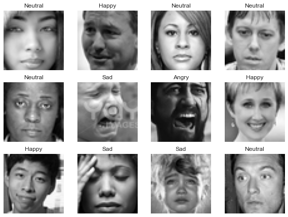
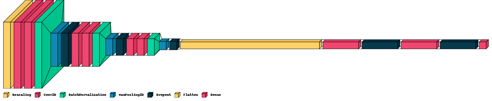
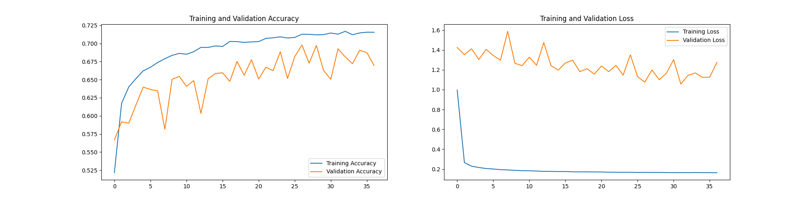

# Facial Expressions Recognition using Deep Learning

Facial expressions are used by humans to convey various types of meaning like emotional states, feelings, and behavioral intentions. In this project, we work on analyzing humans' emotions through facial expressions. We build and train an artificial neural network that can be used to recognize and classify seven basic emotional states from facial expressions images.

## Datasets

In this project, we use open and free datasets available on the internet. 
- Emotion FER-2013 dataset & FER+ Labels :
    - FER-2013 images from Kaggle (https://www.kaggle.com/c/challenges-in-representation-learning-facial-expression-recognition-challenge/data)
    - Corrected labels by 10 crowd-sourced taggers from FER+ (https://github.com/microsoft/FERPlus)
- Iranian Emotional Face Database (IEFDB) : Research paper (https://psyarxiv.com/2ces7/) and files (https://osf.io/a6e2u/)

These are few samples from the datasets : 
<p align="center">

</p>

## Approach

To categorize emotions, we repose our work on the discrete emotional model proposed by Ekman. The model identifies six basic emotion states: Surprise, Anger, Disgust, Happiness, Sadness, and Fear. Those six emotions are universally and biologically experienced by all humans and widely accepted as such in the community. We also add a neutral state to the list to identify the non-emotional state.  
**Preprocessing**  
Before feeding the images to the neural network, we perform the following preprocessing steps : 
- Clean labels' files of the two datasets, and join them.
- Generate images.
- Detect and extract the face using MTCNN (https://github.com/ipazc/mtcnn)
- Resize images to 48*48, and center the faces.
- Convert images to grayscale  
- Rescale images   

**Modeling**  

<p align="center">

</p>

**Results and Evaluation**

<p align="center">

</p>

## Run Locally

Install Tools 
- [Git](https://git-scm.com/download/win)

Clone the project
```bash
  git clone https://git.saslab.tn/ete2022/emotion/learningimage.git
```

Go to the project directory
```bash
  cd learningimage
```

Configure Virtual Environment
- [Create a VE](https://packaging.python.org/en/latest/guides/installing-using-pip-and-virtual-environments/)

Install dependencies
```bash
  pip install -r requirements.txt
```

Download Required Files  
- Go to [FER2013](https://www.kaggle.com/c/challenges-in-representation-learning-facial-expression-recognition-challenge/data?select=icml_face_data.csv) and download **icml_face_data.csv** from Kaggle.  
- Move the downloaded file to /datasets directory.

Run FER
```bash
  cd src
  python run.py
```

When the training is done, everything will be saved to src/models/history/.

## Reference
